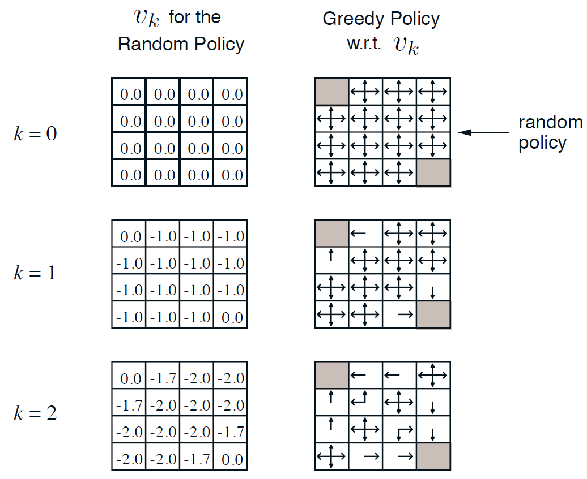

# 3. Loss Functions and Optimization

## Loss Function

지난 시간에는 임의의 W를 이용해 Linear Classifier 를 풀었었다. 이제 중요한 건 W를 어떤 기준으로 어떻게 고를 것인지가 문제이다.



어떤 W 가 가장 좋은지 판단하기 위해서는 지금 만든 W에 대해서 정량적으로 표현할 수 있는 기준이 필요하다. 그 기준이 되어 줄 수 있는 것이 Loss Function 이다. Loss Function 은 그나마 나쁘지 않은 W 를 찾아내기 위한 정량적인 지표가 되어 줄 거다. 이 Loss Function을 최소화 할 수 있는 W를 찾아내는 것을 바로 최적화\(Optimization\) 과정이라고 한다.

## Multiclass SVM Loss


> x : input 값 \(이 예시에서는 image\)  
> y : 예측하고자 하는 것 \(label or target\) -&gt; 정답 카테고리

Image Classification 문제는 x와 W 를 입력으로 받아서 y 를 예측하는 문제이다. 최종 Loss 값인 L 은 데이터 셋 N 개의 평균 Loss 값이다. 


> s = 분류기의 출력으로 나온 예측된 score  
> s\_y\_i = Training data set에서 i 번째 이미지의 정답 클래스의 score

i 번째 데이터의 Loss를 구하기 위한 L\_i의 Loss function은 위와 같다. True인 카테고리를 제외한 나머지 카테고리 y의 합을 구하고, False Categories와 True Category의 score 값을 비교하여 특정 margin 이상이면 Loss를 0으로 만드는 수식이다. 

```text
if (정답 클래스의 score가 가장 높으면)
    return max(0, s_j - s_y_i + 1)
```


Loss Function을 그래프로 나타내면 위와 같다. 그래프 모양 때문에 Hinge Loss Function 이라고 한다. 

> X axis : s\_y\_i 값. 실제 정답 클래스의 score  
> Y axis : Loss 값

정답 클래스의 점수가 올라갈 수록 Loss가 선형적으로 줄어드는 것을 알 수 있다. Loss가 0이 됐다는 건 Classification을 잘 수행했다는 의미이다. \(관례 상, 최소 Loss 값은 정답 class를 제외하고 계산을 해서 0으로 한다.\) 여기서 정의한 Loss 함수는 정답 score가 다른 클래스의 score에 비해 높을 수록 Loss 가 낮아지게 된다.

Q\) 위의 예시에서 safety margin을 1로 잡았는데, 이 값은 어떻게 정해지는가?  
A\) 1 자체는 임의로 선택한 숫자이다. 우리에게 중요한건 Loss function의 score 값이 정확히 몇인지가 아니라, score 간의 차이를 아는 것이다. 한마디로 1의 크게 의미 없는 수치이다. W의 scale이 커질 수록 1의 의미는 그 scale에 의해 상쇄될 것이다.

Q\) 초기 W 값이 너무 작아서 모든 score가 거의 0에 가깝게 되면 Loss는 어떻게 될까?  
A\) 답은 클래스의 갯수 - 1 \(safety margin\) 이다. Loss를 계산할 때 정답이 아닌 class를 순회하기 때문에 C-1 번 순회한다. 비교하게 되는 두 클래스\(s\_j와 s\_y\_i\)의 score가 비슷하니 score가 1이 될 것이다. 이는 디버깅 시 유용한 정보이다. training 처음 시작할 때 Loss 값이 C-1이 아니라면 아마 뭔가 버그가 있을 거다. 


Q\) Loss 함수를 제곱항으로 바꾸면 어떻게 될까? \(squared hinge loss\)  
A\) 제곱의 의미는, 좋은 것과 나쁜 것 사이의 trade off를 비선형적인 방식으로 바꿔준다는 것이다. 그렇게 되면 loss function 계산 자체가 바뀌게 된다.  
     - squared hinge loss : loss에 제곱을 하면 안좋은 것은 더 안좋아진다. 이 의미는 잘못된 것에 대한 패널티가 크다는 의미이다.  
     - hinge loss : 조금 잘못된 것과 많이 잘못된 것을 크게  신경쓰지 않는다. 잘못된 건 잘못된 거고, 얼마나 잘못되었는 지에 대해서는 신경을 쓰지 않는 것이다.   
어떤 Loss Function을 선택할 지는 어떤 문제를 어떻게 풀 지에 따라 정해진다.


```python
def L_i_vectorized(x, y, W):
    scores = W.dot(x)
    margins = np.maximum(0, scores - scores[y] + 1)
    '''
    max로 나온 결과에서 정답 클래스만 0으로 만들어 주는 코드
    굳이 전체를 순회할 필요가 없게 해주는 일종의 vectorized 방법이다.
    전체 합을 구할 때 제외하고 싶은 부분만 0으로 만들어준다.
    '''
    margins[y] = 0
    loss_i = np.sum(margins)
    return loss_i    
```

## Regularization


Training Dataset에 맞춰 loss를 최소화 하는 W 값을 구하더라도, 그것은 Training Dataset에서만 fit 하는 W 값이다. Test Dataset이 들어왔을 때는 완전히 틀린 W가 될 수 있다. 이를 해결하기 위한 방법이 Regularization 이다. 기존의 Loss Function 에 Regularization을 위한 항을 하나 추가 한다. 이는 모델이 좀 더 simple한된 W 값을 선택하도록 해준다. simple 하다는 의미는 보다 일반적이고 general 한 문제를 풀기에 적합한 W 값을 말한다. \(Occam's Razor\)

> **Occam's Razor**  
>  간단하게 오컴의 면도날을 설명하자면, 어떤 현상을 설명할 때 불필요한 가정을 해서는 안 된다는 것이다. 좀 더 쉬운 말로 번역하자면, '같은 현상을 설명하는 두 개의 주장이 있다면, 간단한 쪽을 선택하라\(given two equally accurate theories, choose the one that is less complex\)'는 뜻이다. 여기서 면도날은 필요하지 않은 가설을 잘라내 버린다는 비유로, 필연성 없는 개념을 배제하려 한 "사고 절약의 원리"\(Principle of Parsimony\)라고도 불리는 이 명제는 현대에도 과학 이론을 구성하는 기본적 지침으로 지지받고 있다.

이제 Loss 함수에는 Data Loss term과 Regularization Loss term 두가지 부분으로 이루어진다. Regularization 앞의  λ는 두 항 간의 trade off를 위한 hyperparameter 값이다. 해당 값이 클 수록 Regularization 에 focusing 하는 것이고, 반대의 경우는 Training Dataset 에 좀 더 fit 하게 맞추게 된다.

정리하면 Regularization 이 하는 역할은 아래와 같이 두가지이다.  
: 모델이 Taining Dataset에 완벽히 fit 하지 못하도록 모델의 복잡도에 penalty를 부여하는 방법

1. 모델이 더 복잡해지지 못하도록 하는 것
2. 모델에 soft penalty를 추가하는 것 : 여전히 더 복잡한 모델이 될 가능성이 있기 때문에 soft penalty를 추가하는 것이다. 더 복잡한 모델을 사용하고 싶다면 penalty 를 감당해야 한다.


**L2 regularization**  
- 가중치 행렬 W에 대한 Euclidean Norm \(squared norm\)  
- output으로 나오는 값이 너무 크지 않게 만들기 위해서 1/2 \* squared norm을 사용하기도 한다.   
- 모델 가중치의 L2 norm의 제곱\(가중치 각 요소 제곱의 합\)에 대해 penalty를 부과한다.   
- 아주 큰 값이나 작은 값을 가지는 outlier 모델 가중치에 대해 0에 가깝지만 0이 아닌 값으로 만듦으로써 선형 모델의 일반화 능력을 개선시킨다.

**L1 regularization**  
- 모델 가중치의 L1 norm \(가중치 각 요소 절대값의 합\)에 대해 penalty를 부과한다.   
- 대부분의 요소값이 0인 sparse feature에 의존한 모델에서, 불필요한 feature에 대응하는 가중치들을 0으로 만듦으로써 해당 feature를 모델이 무시하도록 만든다. 이는 feature selection 효과가 있다는 말이다.

**Elastic net \(L1 + L2\)**  
- L1와 L2를 섞은 방식. 

> 변동이 심한 어떤 입력값 x 가 있다. 어떤 문제의 답을 찾을 때 그 x의 특정한 feature에 요소하기 보다, 모든 x의 feature 들이 골고루 영향을 미치길 원한다면 L2 Regularization 를 선택한다. 그럼 그 model은 보다 robust 해질 수 있을 것이다. 반대로 L1은 일반적으로 sparse 한 solution을 선호한다.  
> L2 regularization likes to "spread out" the weights

## Softmax Classifier


Multi-class SVM Loss에서는 score 자체에 대한 해석은 고려하지 않았다. 하지만 Softmax \(Multinomial Logistic Regression\) 의 loss 함수는 score 자체에 대해 추가적인 의미를 부여한다.

$$
Li = -log P(Y=yi | X = xi)
$$

score를 위의 수식에 넣어 클래스 별 확률 분포를 계산하게 된다. score들에 지수를 취해 양수가 되게 만들고, 그 지수들의 합으로 다시 정규화 시키면 확률 분포를 얻을 수 있다. 이것이 바로 해당 클래스가 될 확률을 뜻한다.

결국 정답 클래스에 해당하는 클래스의 확률이 1에 가깝게 계산되기를 원하는 것이고, Loss 함수는 -log \(정답 클래스일 확률\) 이 된다. log를 취하는 이유는, log가 단조 증가 함수라 log 값을 최대화 시키는 것이 그냥 확률값을 최대화 시키는 것보다 쉽기 때문에 사용하는 것이다.


Softmax와 SVM Loss 함수는 score를 해석하는 방식이 조금 다르다.

* SVM : 정답 score와 정답이 아닌 score 간의 margins에 focusing
* Softmax \(cross-entropy\) : 각 class에 대한 확률을 구하고 -log\(정답 클래스일 확률\)에 focusing

SVM의 Loss 함수의 경우, 일정 margins을 넘기면 더이상 성능 개선에 신경쓰지 않는다. 하지만 Cross-Entropy는 정답 클래스의 확률을 1로 만들기 위해 노력하기 때문에 자연스럽게 성능 개선이 될 수 있다.

## Optimization

그럼 이 Loss 함수를 최소화 하는 W 는 어떻게 찾을까? 이것이 바로 Optimization 문제이다.

언덕을 걸어간다고 할 때 가장 낮은 계곡 \(loss\)은 어떻게 해야 알아낼 수 있을까. 도달한 계곡이 정말 가장 낮은 계곡인지 \(최소한의 loss인지\) 알기 위해서는 끝까지 가봐야만 알 수 있다. iterative 하게 문제를 푸는 것이다.

### Random Search

```python
# the class scores for all test examples
scores = Wbest.dot(Xte_cols)
# find the index with max score in each column (the predicted class)
Yte_predict = np.argmax(scores, axis = 0)
# and calculate accuracy (fraction of predictions that are correct)
np.mean(Yte_predict == Yte)
```

가장 단순한 방법은 Random 하게 Searching 하는 거다. 여러 W 를 모아놓고 랜덤하게 loss 가 가장 낮은 값을 찾아가는 방법이다. 아주 무식한 방법이다.

### Follow the slope


Follow the slope 방법은 말 그대로 경사를 따라서 경사가 있는 쪽을 향해 걸어가는 거다. 미분값을 통해 gradient를 구하면 함수의 경사를 구할 수 있다. 다변수인 상황에서 미분으로 일반화 시켜보면 gradient는 벡터 x의 각 요소들의 편도함수들의 집합이다. gradient가 함수의 어떤 점에서 선형 1차 근사 함수를 알려준다. 많은 딥러닝 알고리즘들이 gradient를 계산하고 parameter 벡터를 업데이트 할 때 사용한다.


gradient 값을 구하기 위해 특정 W에 아주 작은 값을 더하고 Loss를 계산한 뒤, FDM을 이용해 극한을 취하고 해당 요소의 gradient의 근사치를 계산해볼 수 있다.

하지만 실제로는 사용하지 않는다. 너무 느리기 때문이다. gradient 하나를 구하기 위해 수천개의 함수값을 일일이 다 계산해야 하기 때문이다.  
Numeric Gradient  
 - Too Slow. Need to loop over all dimensions  
 - Approximate


근데 사실 위와 같이 계산하는 방법은 필요 없다. 미분 계산만 잘 하면 gradient가 계산되어 나온다. gradient를 나타내는 식이 뭔지만 먼저 찾아내고 그걸 수식으로 나타내서 한번에 gradient dW를 계산하는 거다.

### Gradient Descent

```python
# Vanilla Gradient Descent
while True:
    weights_grad = evaluate_gradient(loss_func, data, weights)
    # perform parameter update
    weights += - step_size * weights_grad 
```

W를 임의의 값으로 초기화 하고. Loss와 gradient를 계산한 뒤에 weights를 gradient의 반대 방향으로 업데이트 한다. gradient가 함수에서 증가하는 방향이기 때문에 - gradient를 해야 내려가는 방향이 된다. 

-gradient 방향으로 조금씩 이동할 거고, 이걸 계속 반복하다보면 결국 수렴하게 될 거다.   
step\_size : hyperparameter. learning rate이라고도 한다. 

### Stochastic Gradient Descent \(SGD\) 


 Loss를 계산하는건 오래 걸리는 일이다. N개의 데이터셋의 gradient를 한번 계산하기 위해선 N 번의 iterate를 돌아야 한다. W가 일일이 업데이트 되려면 많은 시간이 걸릴 거다. 그래서 실제로는 SGD 방법을 사용한다. 

전체 데이터 셋의 gradient와 loss 값을를 계산하지 않고 minibatch라는 작은 트레이닝 샘플 집합으로 나눠서 학습하는 것이다. 보통 2의 숭수로 정하며, 32, 64, 128을 보통 사용한다. 이 작은 minibatch를 이용해서 loss 의 전체 합의 "추정치"와 실제 gradient의 "추정치"를 계산하는 것이다. monte carlo method 의 실제 값 추론과 비슷한 방법이라고 보면 된다.

```python
# Vanilla Minibatch Gradient Descent
While True:
    # sample 256 examples
    data_batch = sample_training_data(data, 256) 
    weights_grad = evaluate_gradient(loss_fun, data_batch, weights)
    # perform parameter update
    weights += - step_size * weights_grad 
```

 코드는 간단하다. 임의의 minibatch에서만 gradient를 계산하고 그 값을 사용한다.

## Feature Vector


이전 강의에서 말했듯이 raw 이미지를 input으로 사용하기에는 성능상 좋지 않은 방법이다.  \(ex, Multi Modality\) 그래서 DNN이 있기 이전에의 이미지 전처리는 두가지 step으로 진행됐다. 

1. raw 이미지에서 여러가지 feature 들을 계산해서 추출 
2. 여러 feature 들을 연결시켜 하나의 feature vector로  병합

이렇게 뽑아낸 feature vector을 input image로 사용했다.


 왼쪽과 같은 그림의 경우 linear classifier로 바로 풀 수 없는 문제이다. 이를 변형시켜 \(극좌표계로 이동\) linear하게 풀 수 있는 형태로 데이터를 가공한다. 이와 같이 문제를 풀기 위해서는 어떤 특징 변환이 필요한가를 알아내야 한다. 

### Color Histogram


이미지의 hue 값만 뽑아서 모든 픽셀을 각 차트에 넣어, 몇개의 픽셀이 있는 지 갯수를 새서 특징벡터로 이용한다. 이미지가 전체적으로 어떤 색인지 알 수 있다. 

### Histogram of Oriented Gradients \(HoG\)


NN이 뜨기 이전에 인기있었떤 또 다른 특징 벡터 중 하나는 바로 Histogram of Oriented Gradients \(HoG\) 이다. Oriented edges가 중요하다고 보고 local orientation edges를 측정하는 방법이다. 픽셀을 나눠서 해당 픽셀 지역 내에서 가장 orientation 이 강한 값을 뽑아내면 그 값이 edge orientation 에 대한 히스토그램이 되는 거다. 어떤 종류의 edge가 있는지, 지역적으로 어떤 edge가 존재하는지도 알 수 있다.

### Bag of Words


Bag of Words는 NLP에서 영감을 받은 특징 벡터이다. NLP에서의 특징벡터는 특정 문장에 있는 각 단어의 발생 빈도를 세서 이를 특징 벡터로 사용하는 것이다. 이 직관을 그대로 이미지에 적용한 것이다. 이 visual word를 뽑아내기 위해 이미지들을 임의대로 조각내고 K-means 등의 군집화 알고리즘을 이용해 조각들을 모은다. 이미지 내의 다양한 요소들을 표현할 수 있는 다양한 군집들을 만들어 내는 것이다. 이 이미지가 어떻게 생겼는지에 대한 다양한 정보를 제공할 수 있다.

### Image features vs ConvNets


5~10년 전까지만 해도 이미지를 입력받으면 BOW나 HOG와 같은 다양한 특징 표현을 계산하고 특징들을 모아 연결해서 추출된 특징들을 입력으로 사용했었다. 특징이 한번 추출되면 feature extractor는 classifer 하는 동안은 변형되지 않고 classifer 모델만 업데이트 된다.


ConvNets은 이미 만들어 놓은 특징들을 쓰기 보다는 데이터로부터 특징들을 직접 학습한다. raw 이미지가 그대로 들어가고 여러 레이어를 거쳐 데이터를 통한 특징벡터를을 직접 만들어낸다. classfier만 훈련하는게 아니라 가중치 전체를 한꺼번에 훈련하는 것이다.

자세한 방법은 다음 강의에서 알아보자.

